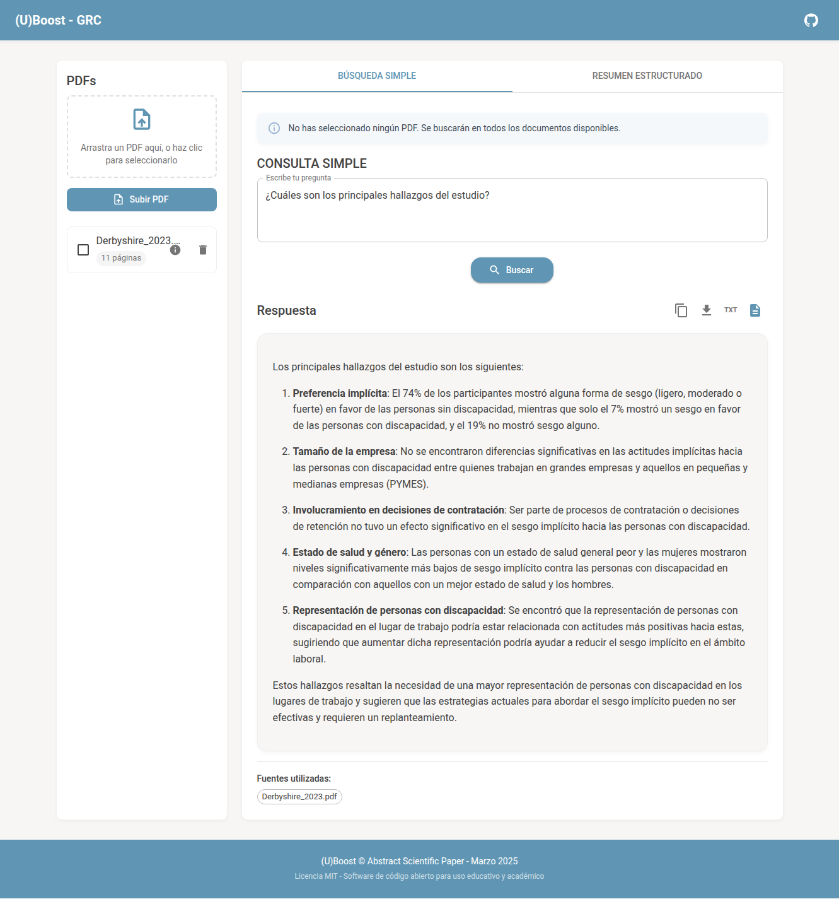
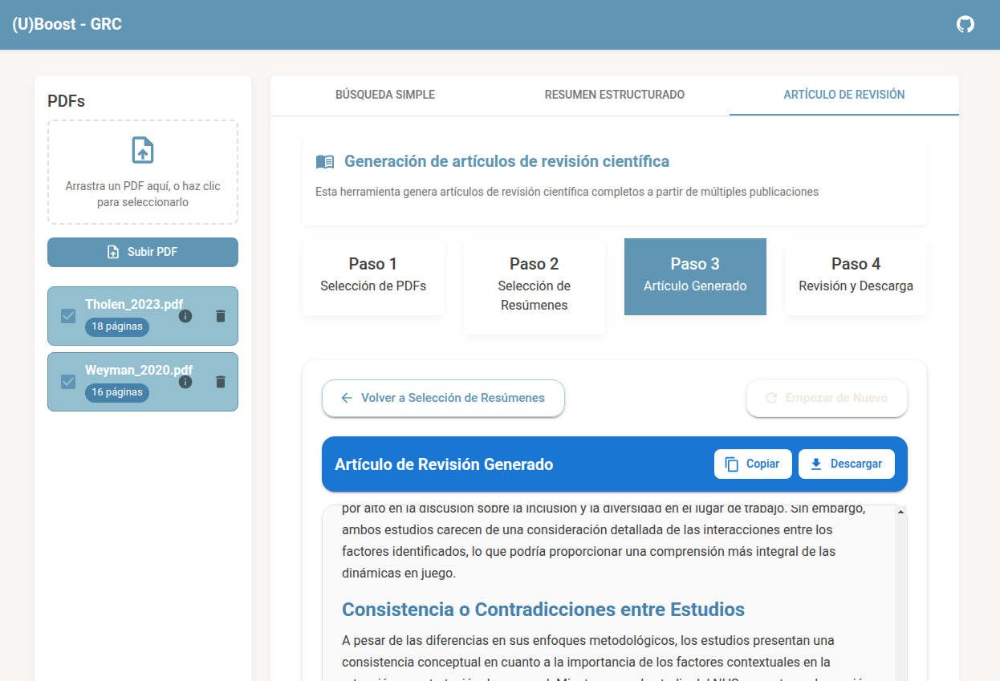

# 🚀 (U)Boost scientific paper 📝✨


**(U)Boost scientific paper** es una potente aplicación web para procesar, analizar y generar contenido académico a partir de artículos científicos en formato PDF. Utiliza tecnología RAG (Retrieval Augmented Generation) junto a modelos avanzados de OpenAI (GPT-4o, GPT-4o-mini) y Anthropic (Claude 3.7 Sonnet), proporcionando análisis detallados y precisos con una interfaz moderna y amigable basada en Material-UI.

<p align="center">
  <b>Sistema avanzado de procesamiento, análisis y síntesis de documentos científicos con tecnología RAG</b>
</p>

## 📸 Capturas de pantalla


*Inteligencia sobre artículo: Consulta contextual precisa sobre PDFs científicos*


*Artículo de revisión científica: Generación de revisiones completas a partir de múltiples PDFs*

---

## 🔥 Características principales

- 🔑 **Configuración sencilla de API Keys**
  - Interfaz gráfica para configurar tus claves API de OpenAI y Anthropic.
  - Validación en tiempo real de las claves ingresadas.
  - Indicador visual del estado de configuración.
  - Instrucciones paso a paso para obtener las claves.

- 📚 **Gestión avanzada de PDFs**
  - Carga rápida y sencilla de documentos PDF.
  - Visualización de documentos subidos.
  - Selección individual o múltiple para análisis específico.

- 🔍 **Inteligencia sobre artículo**
  - Consultas contextuales precisas sobre el contenido de los PDF.
  - Ejemplos pre-configurados para análisis de variables, metodologías, resultados y síntesis.
  - Respuestas referenciadas directamente a las fuentes originales.

- 📝 **Generación de resúmenes estructurados**
  - Organización clara según normas académicas con 10+ secciones detalladas.
  - Títulos adaptados a normas RAE y tablas de variables bien estructuradas.
  - Referencias APA completas con información de recuperación.
  - Soporte multilenguaje: Español, Inglés, Francés, Alemán, Italiano, Portugués.

- 📄 **Artículo de revisión científica** (Beta)
  - Generación de artículos de revisión completos a partir de múltiples resúmenes PDFs.
  - Estructura académica con secciones personalizables a través de instrucciones específicas.
  - Síntesis coherente de información de múltiples fuentes con referencias cruzadas.

- 📊 **Análisis de uso y costes**
  - Contador en tiempo real de PDFs procesados por sesión.
  - Seguimiento en vivo del consumo total de tokens.
  - Cálculo automático de costes basado en modelo seleccionado.

- ⚙️ **Opciones avanzadas de IA**
  - **Tokens máximos:** Controla la longitud máxima del contenido generado.
  - **Temperatura:** Ajusta la creatividad de las respuestas (0.7 recomendado).
  - **Top P:** Diversidad léxica (0.9-1 recomendado).
  - **Penalización frecuencia:** Evita repetición de frases.
  - **Penalización presencia:** Evita repetición de temas.

- 💾 **Opciones de exportación**
  - Descarga en formato Markdown (.md) y texto plano (.txt).
  - Copia rápida directa al portapapeles.

- 🎨 **Interfaz moderna y amigable**
  - Diseño intuitivo y responsive con Material-UI.
  - Asistentes contextuales con ejemplos copiables para cada función.
  - Feedback visual durante cargas y generación de contenido.

---

## 🎛️ Parámetros avanzados de IA

| Parámetro | Descripción | Valores recomendados |
|-----------|-------------|----------------------|
| **Tokens máximos** | Longitud máxima del texto generado | 8192 (GPT-4o), 4096 (GPT-4o-mini) |
| **Temperatura** | Creatividad/Aleatoriedad de respuestas | 0 (bajo), 0.7 (medio, recomendado), 2 (alto) |
| **Top P** | Diversidad léxica en generación | 0.9-1 |
| **Penalización frecuencia** | Evitar repetición de frases | 0 a 2 |
| **Penalización presencia** | Evitar repetición temática | 0 a 2 |

> **Nota:** Experimenta según el tipo y objetivo del análisis.

---

## 💻 Arquitectura tecnológica

### Frontend 🖥️
- React 18
- Material-UI
- Axios (Cliente HTTP)
- ReactMarkdown (remark-gfm, tablas Markdown)

### Backend ⚙️
- Node.js (18+) y Express
- OpenAI API (GPT-4o, GPT-4o-mini)
- Anthropic API (Claude 3.7 Sonnet)
- Multer (middleware subida PDFs)
- PDF.js (procesamiento PDFs)

---

## 🚀 Instalación y ejecución

### 🔧 Requisitos previos
- Node.js v18+
- npm o yarn
- Claves API de OpenAI y Anthropic

### ��️ Instalación rápida
```bash
git clone https://github.com/686f6c61/abstract-scientific-paper.git
cd abstract-scientific-paper
npm install
```

### ⚙️ Configuración de variables de entorno
Crear archivo `.env` en `/server` basado en `.env.example`:
```env
OPENAI_API_KEY=sk-...
ANTHROPIC_API_KEY=sk-ant-...
```

> **Nota**: Las API Keys también pueden configurarse directamente desde la interfaz gráfica de la aplicación usando el botón de configuración en la barra superior.

### 🔑 Obtención de API Keys

#### OpenAI API Key (para GPT-4o y GPT-4o-mini)
1. Crea una cuenta en [OpenAI Platform](https://platform.openai.com/signup)
2. Ve a la sección de [API Keys](https://platform.openai.com/api-keys)
3. Haz clic en "Create new API key"
4. Copia la API key generada (comienza con "sk-")

#### Anthropic API Key (para Claude 3.7 Sonnet)
1. Crea una cuenta en [Anthropic Console](https://console.anthropic.com/signup)
2. Ve a la sección de [API Keys](https://console.anthropic.com/account/keys)
3. Haz clic en "Create key"
4. Copia la API key generada (comienza con "sk-ant-")

### ▶️ Ejecución de la aplicación
```bash
npm start
```
- Frontend React: `http://localhost:3000`
- Backend Express: `http://localhost:5000`

---

## 📂 Estructura del proyecto

```
📁 abstract-scientific-paper
├── 📁 client
│   ├── 📁 src
│   │   ├── 📁 components   # Componentes React
│   │   ├── 📁 contexts     # Gestión de estados globales
│   │   └── 📁 utils        # Utilidades frontend
│
└── 📁 server
    ├── 📁 controllers      # Controladores API
    ├── 📁 routes           # Rutas y endpoints API
    ├── 📁 utils            # Procesamiento PDFs y prompts
    └── 📁 uploads          # PDFs cargados
```

---

## 🧠 Implementación avanzada RAG (Retrieval Augmented Generation)

- Basado en [OpenAI Cookbook](https://cookbook.openai.com/examples/file_search_responses).
- Extracción eficiente de contenido PDF mediante embeddings optimizados.
- Búsqueda paralela mejorada para grandes colecciones.
- Generación de resúmenes con referencias bibliográficas precisas.
- Reconocimiento específico de estructura académica y elementos visuales (tablas, figuras).

---

## 📋 Limitaciones del sistema

- Optimizado principalmente para documentos académicos en texto.
- Documentos con ecuaciones complejas, muchas tablas o gráficos visuales pueden no procesarse de forma óptima.
- Documentos extremadamente largos o complejos pueden afectar al rendimiento y coste.

---

## 🤝 Contribuciones

Las contribuciones son bienvenidas. Sigue estos pasos para contribuir:

1. Haz un fork del repositorio.
2. Crea una rama para tu funcionalidad (`git checkout -b feature/nueva-funcionalidad`).
3. Realiza los cambios y commits (`git commit -m "añade nueva funcionalidad"`).
4. Envía la rama (`git push origin feature/nueva-funcionalidad`).
5. Abre un Pull Request en GitHub.

---

## 📜 Licencia

Este proyecto está disponible bajo Licencia MIT. Ver [`LICENSE`](LICENSE) para detalles.

---

## 📋 Ejemplos de resúmenes generados

### Ejemplos de contenido generado

- [**Resumen generado con GPT-4o-mini**](examples/sample-abstract-4o-mini.md) - La importancia de la representación de personas con discapacidad para abordar el sesgo implícito en el lugar de trabajo

- [**Artículo de revisión generado con Claude 3.7 Sonnet**](examples/sample-review-claude-sonnet-37.md) - La importancia del capital psicológico en la relación entre orientación religiosa y estrés laboral

## 📧 Contacto y soporte

Si tienes dudas o sugerencias, abre un issue en este repositorio. ¡Responderemos con gusto!

---

<p align="center">
Desarrollado con ❤️ para el análisis avanzado de documentos científicos<br>
(U)Boost scientific paper - Marzo 2025
</p>
